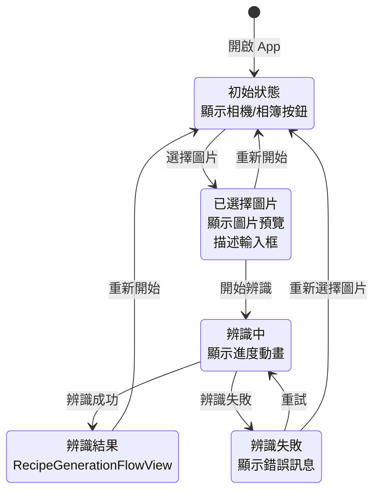
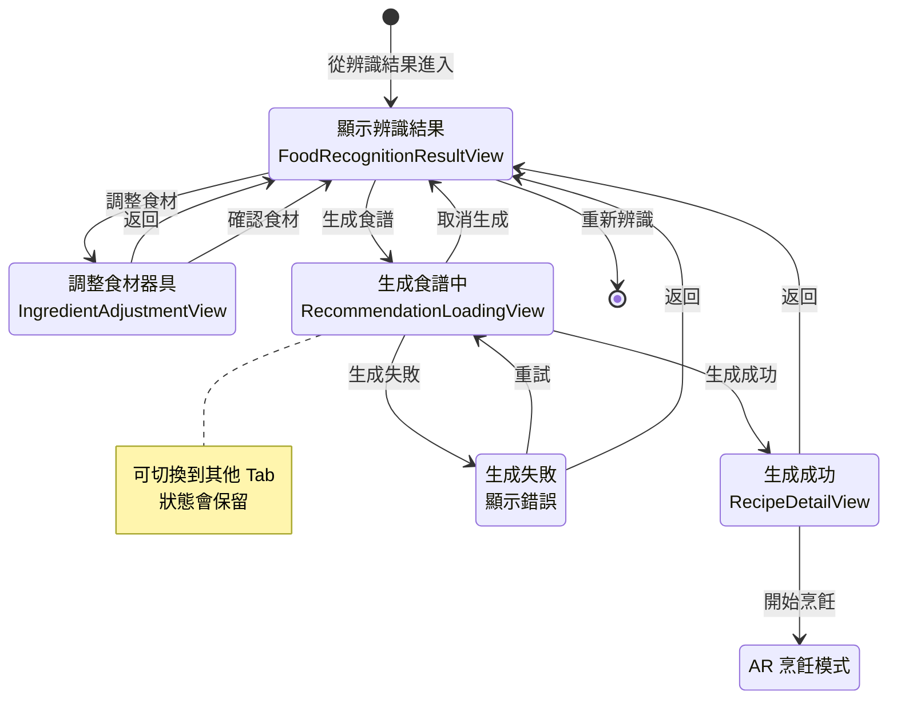
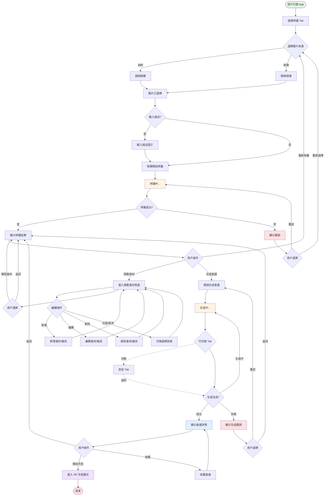
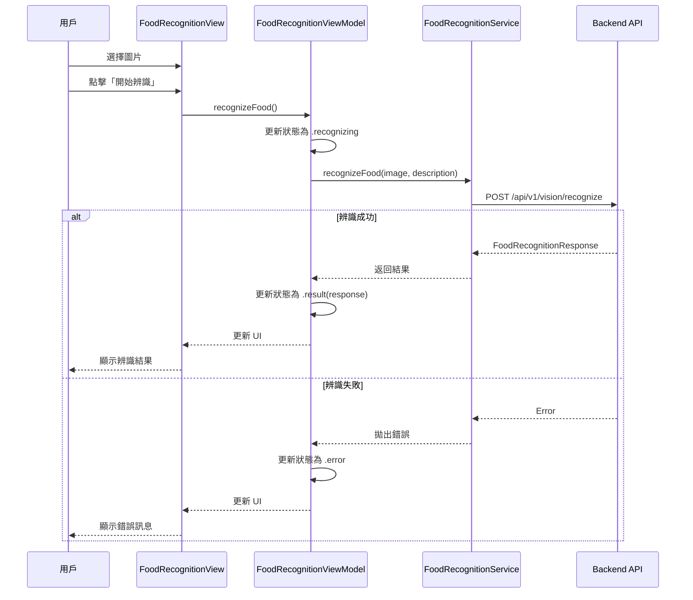
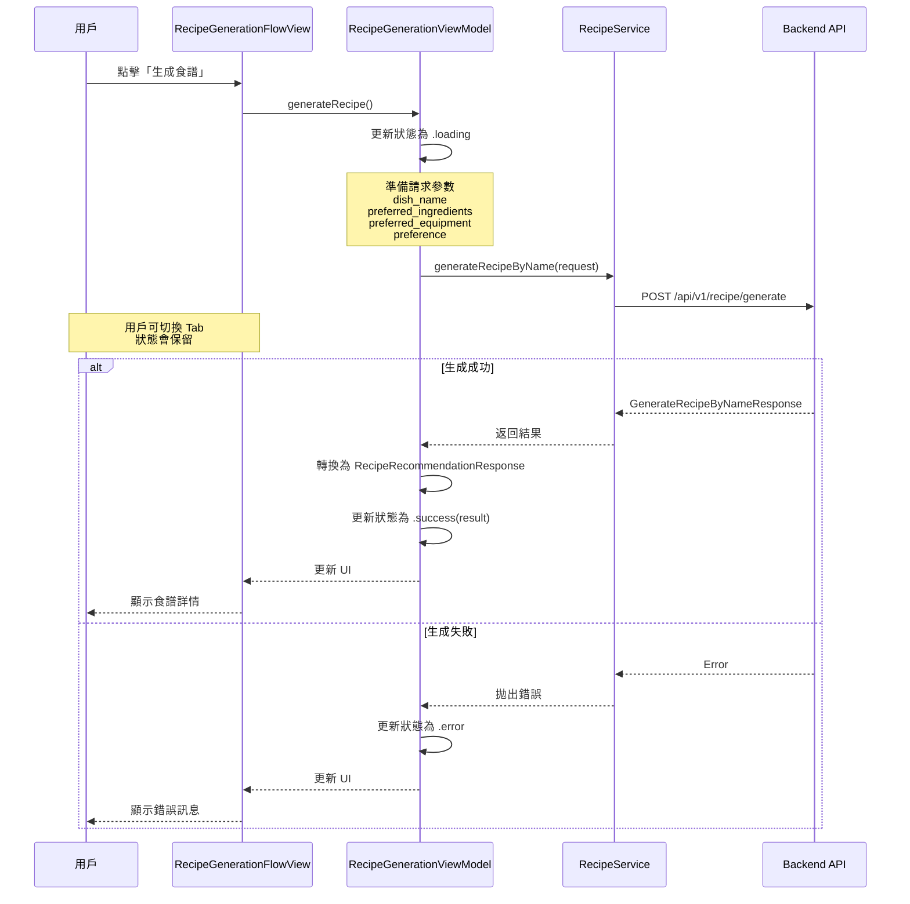
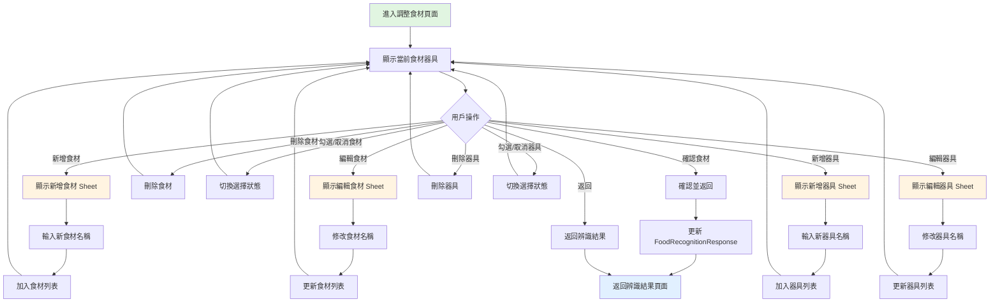
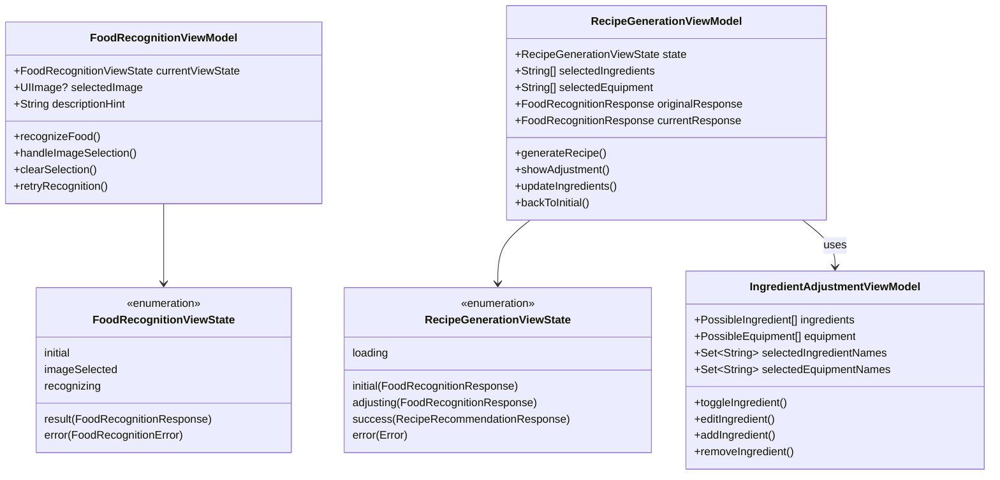
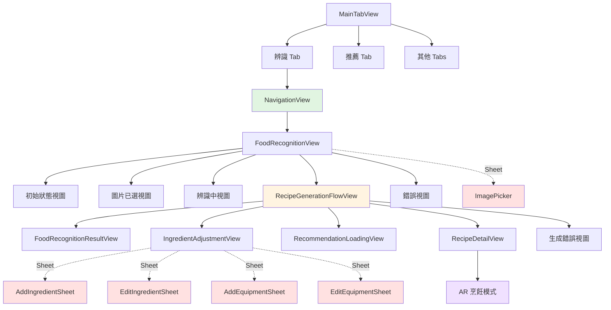

# 食物辨識功能畫面跳轉流程圖

> 本文件包含 Mermaid 流程圖，可直接在 HackMD、GitHub 或支援 Mermaid 的 Markdown 編輯器中查看

## 1. FoodRecognitionView 完整狀態流程

## 2. RecipeGenerationFlowView 狀態流程

## 3. 完整用戶操作流程

## 4. API 呼叫流程

### 食物辨識 API

### 食譜生成 API

## 5. 食材調整功能流程

## 6. 狀態管理架構

## 7. 導航層級結構

## 關鍵文件對應

| 畫面/功能 | 檔案路徑 |
|---------|---------|
| 主要辨識視圖 | Features/FoodRecognition/Views/FoodRecognitionView.swift |
| 辨識結果視圖 | Features/FoodRecognition/Views/FoodRecognitionResultView.swift |
| 食譜生成流程 | Features/FoodRecognition/Views/RecipeGenerationFlowView.swift |
| 食材調整視圖 | Features/FoodRecognition/Views/IngredientAdjustmentView.swift |
| 辨識錯誤視圖 | Features/FoodRecognition/Views/FoodRecognitionErrorView.swift |
| 辨識 ViewModel | Features/FoodRecognition/ViewModels/FoodRecognitionViewModel.swift |
| 生成 ViewModel | Features/FoodRecognition/ViewModels/RecipeGenerationViewModel.swift |
| 導航協調器 | Features/FoodRecognition/Coordinators/FoodRecognitionCoordinator.swift |
| 辨識服務 | Features/FoodRecognition/Services/FoodRecognitionService.swift |
| 食譜服務 | Features/Recommendation/Services/RecipeService.swift |

## 注意事項

1. **NavigationView 不可嵌套**：FoodRecognitionView 已有導航功能，子視圖不應再包 NavigationView
2. **狀態保留**：在食譜生成時切換 Tab 不會中斷生成過程
3. **食材更新**：調整食材後會創建新的 FoodRecognitionResponse，保留原始結果
4. **工具列按鈕**：「重新開始」按鈕只在有圖片或結果時顯示
5. **返回按鈕**：調整食材頁面使用自定義返回按鈕，隱藏系統預設按鈕

## 如何在 HackMD 中使用

1. 複製上面任何一個 Mermaid 代碼塊（包含 \`\`\`mermaid 和 \`\`\`）
2. 貼到 HackMD 編輯器中
3. 流程圖會自動渲染顯示

### Mermaid 語法快速參考

- **狀態圖**：`stateDiagram-v2`
- **流程圖**：`flowchart TD` (上到下) 或 `flowchart LR` (左到右)
- **時序圖**：`sequenceDiagram`
- **類別圖**：`classDiagram`
- **箭頭**：`-->` 或 `-.->` (虛線)
- **帶文字箭頭**：`-->|文字|`
- **判斷節點**：`{判斷內容}`
- **圓角節點**：`([內容])`
- **註解**：`note right of NodeName: 註解內容`
