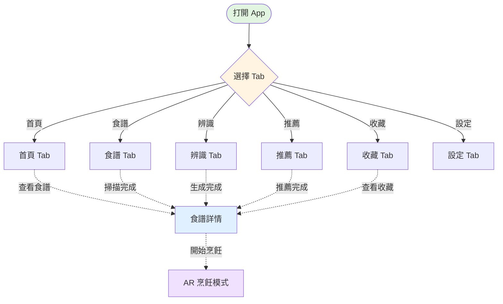
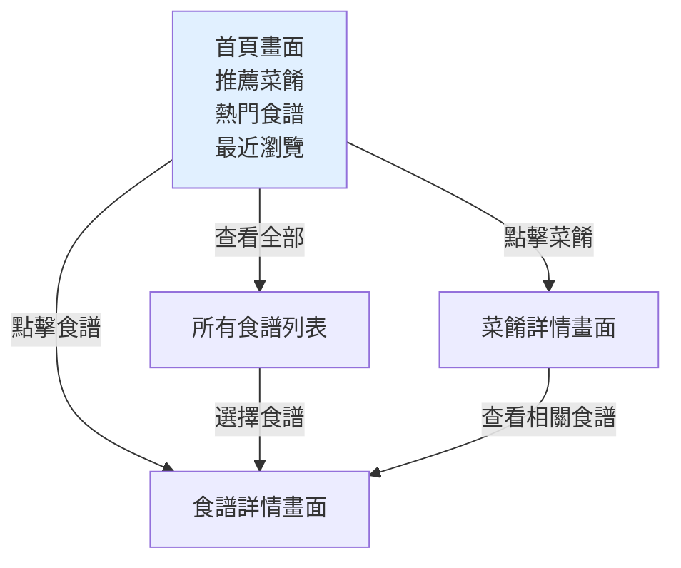
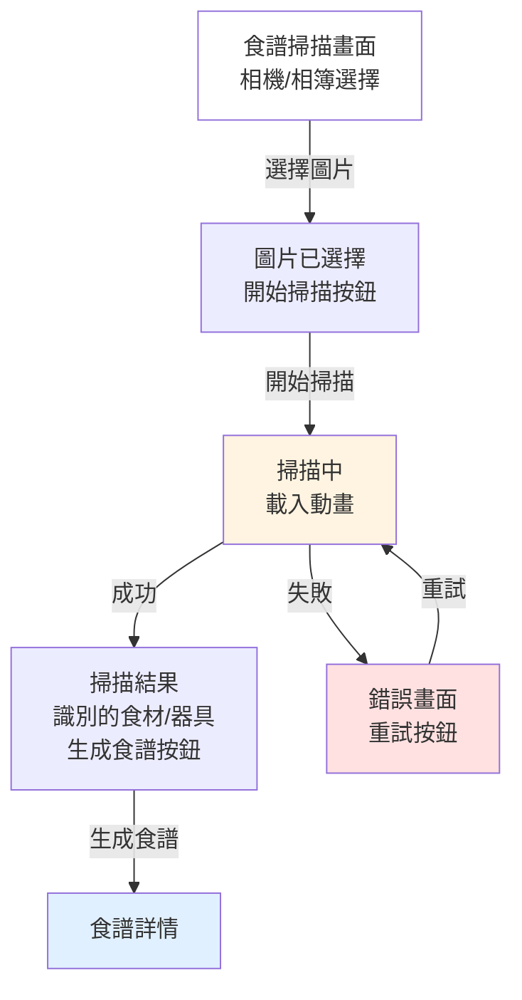
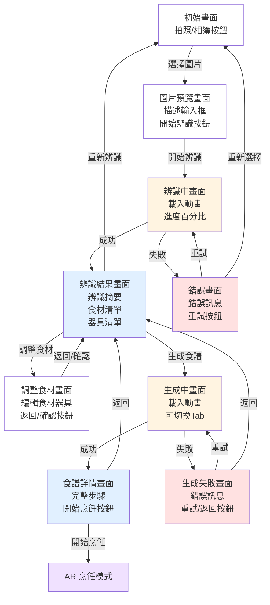
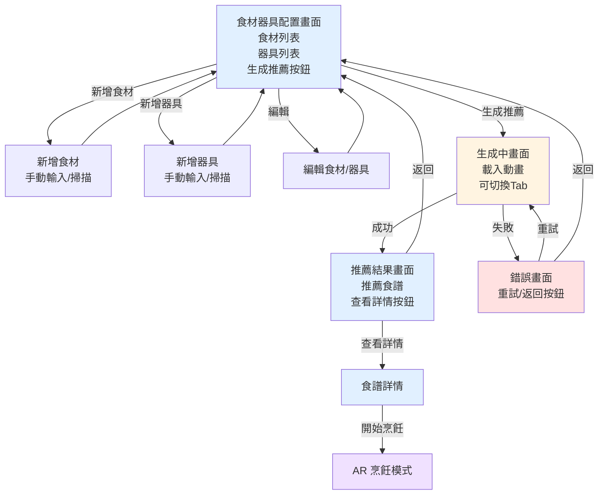
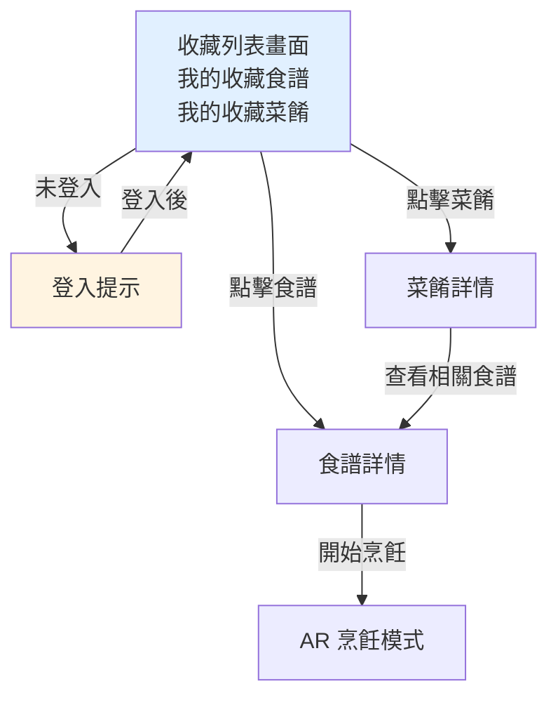
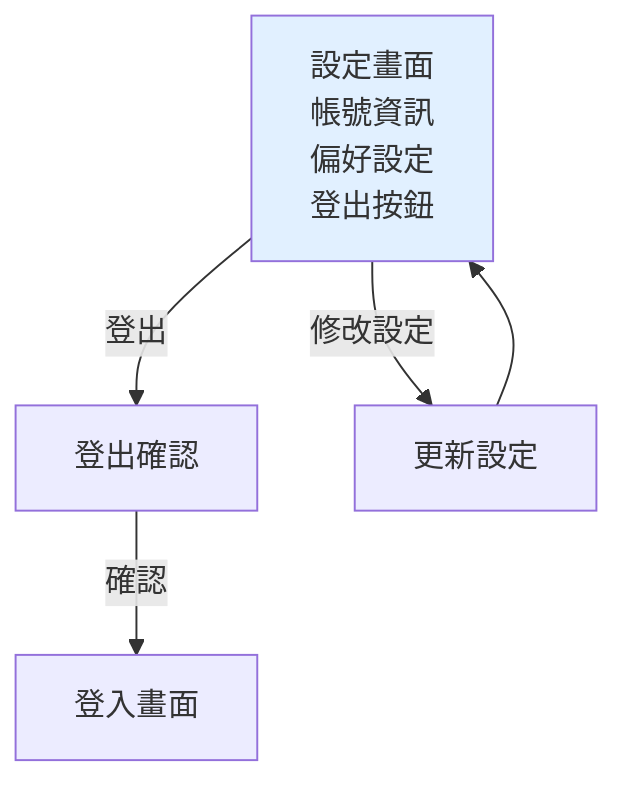
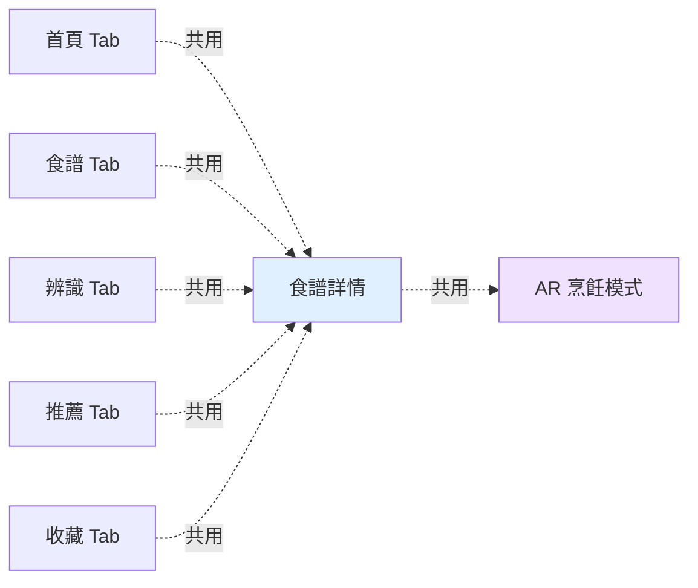

# App 完整畫面流程圖

> 可直接複製到 HackMD 查看

## 所有 Tab 總覽

---

## 1. 首頁 Tab 流程

---

## 2. 食譜 Tab 流程

---

## 3. 辨識 Tab 流程

---

## 4. 推薦 Tab 流程

---

## 5. 收藏 Tab 流程

---

## 6. 設定 Tab 流程

---

## Tab 之間的關係

---

## 主要畫面說明

### 辨識 Tab

| 畫面 | 顯示內容 |
|------|---------|
| 初始畫面 | 拍照按鈕、相簿按鈕 |
| 圖片預覽 | 圖片、描述輸入框、開始辨識按鈕 |
| 辨識中 | 載入動畫、進度條 |
| 辨識結果 | 食材清單、器具清單、三個按鈕（生成食譜、調整食材、重新辨識） |
| 調整食材 | 食材/器具列表、編輯功能、確認按鈕 |
| 生成中 | 載入動畫、可切換Tab |
| 食譜詳情 | 完整步驟、開始烹飪按鈕、返回按鈕 |
| 錯誤畫面 | 錯誤訊息、重試按鈕 |

### 推薦 Tab

| 畫面 | 顯示內容 |
|------|---------|
| 配置畫面 | 食材列表、器具列表、新增/編輯按鈕、生成推薦按鈕 |
| 新增食材/器具 | 手動輸入、掃描選項 |
| 生成中 | 載入動畫、可切換Tab |
| 推薦結果 | 推薦的食譜、查看詳情按鈕 |
| 錯誤畫面 | 錯誤訊息、重試/返回按鈕 |

### 其他 Tab

| Tab | 主要內容 |
|-----|---------|
| 首頁 | 推薦菜餚、熱門食譜、最近瀏覽 |
| 食譜 | 掃描功能、食材識別 |
| 收藏 | 收藏的食譜和菜餚列表 |
| 設定 | 帳號資訊、偏好設定、登出 |

### 共用畫面

| 畫面 | 出現位置 |
|------|---------|
| 食譜詳情 | 所有 Tab 都可以進入 |
| AR 烹飪模式 | 從食譜詳情進入 |
